# Graph Neural Network

The architecture of this project is inspired by [https://github.com/open-mmlab](https://github.com/open-mmlab)

There are **GraphSAGE**, **GAT** models. Other models will be added soon. Stay tuned!

**GraphSAGE**

[Inductive Representation Learning on Large Graphs](https://arxiv.org/pdf/1706.02216.pdf) (William L. Hamilton et al.)
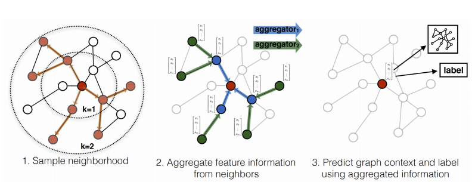

**GAT**

[Graph Attention Networks](https://arxiv.org/pdf/1710.10903.pdf) (Yoshua Bengio et al.)
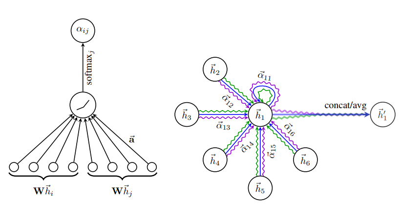

### Dependencies

* Python==3.6+
* tensorflow==2.1.1
* tensorflow-tensorboard==2.1.0
* numpy==1.18
* networkx==2.4
* tensorflow_addons==0.9.1

### Usage

**Config file:**
* In *model* dict define the model architecture
* Define *learning rate* schedule and *optimizer* params
* In *train_cfg* and *test_cfg* define needed settings for training/testing phase that are used in model class.
* Define *dataset_type* for training/validation/testing
* Define *data loader* type and its chain operations that are exist in [tf.data API](https://www.tensorflow.org/guide/data?hl=ru)
* In *work_dir set* up folder name for saving logs and models
* *restore_model_path* for restoring the needed model
* To set training and validation pipelines use *workflow* variable: type of mode (train/valid) and number of times for repeating the given mode

**Training:**

For training run *main_train.py* file

In API folder *train.py* contains whole high-level logic for training, in *runner.py* all details of training process.

### Results for GraphSAGE
Valid *PPI* dataset

Mean Aggregator | Max Pool Aggregator | RNN Aggregator 
----------------| --------------------| --------------
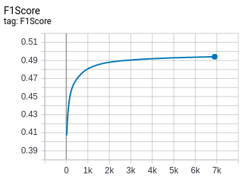 | 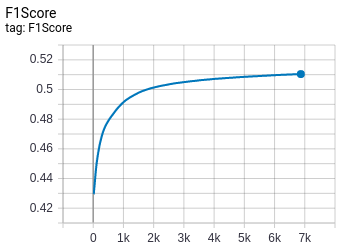 | 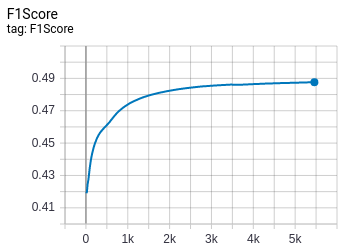
Node embeddings by ground truth label #23 | |
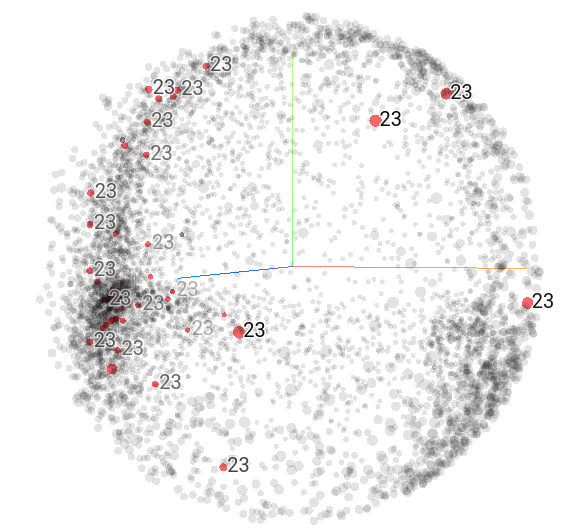 | 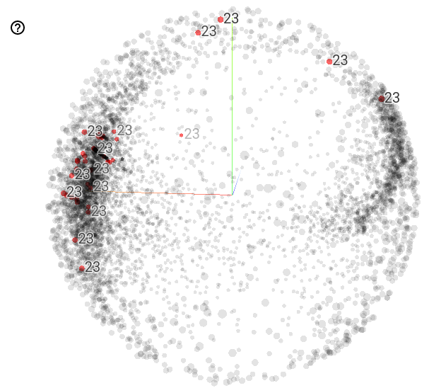 | 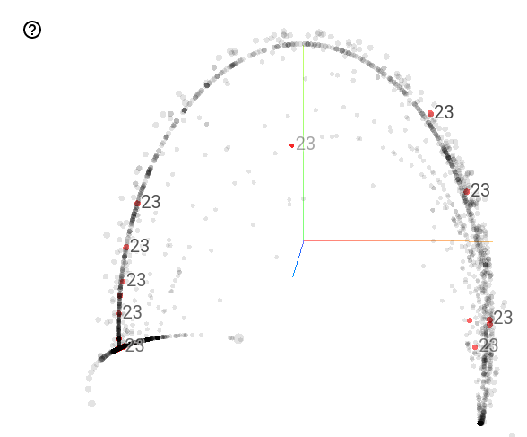
Node embeddings by labels with the highest score | |
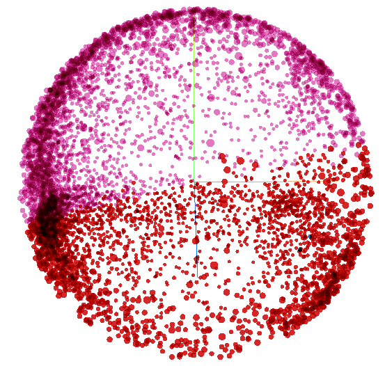 | 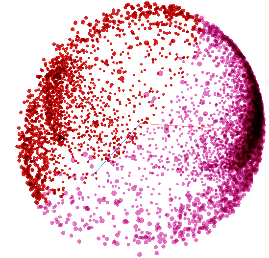 | 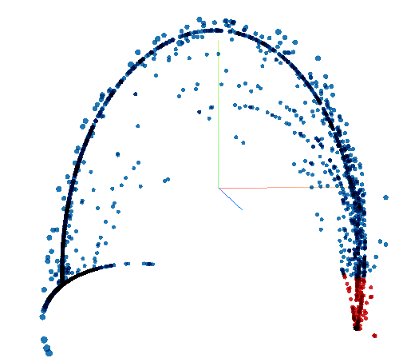

### Author
[Firiuza](https://medium.com/@Firiuza) medium / [Firyuza](https://github.com/Firyuza) github / [Firiuza](https://twitter.com/Firiuza1) twitter

